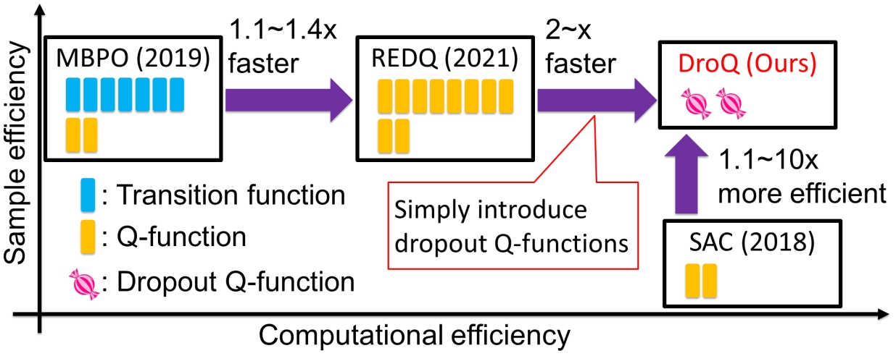
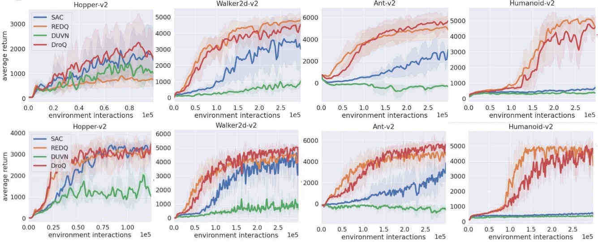

# What is this?
Source code to replicate experiments provided in [``Dropout Q-Functions for Doubly Efficient Reinforcement Learning.''](https://openreview.net/forum?id=xCVJMsPv3RT) [(poster)](https://drive.google.com/file/d/1_JSuwlUsMjzo6zRaAIcXXj3__AmOvu2t/view?usp=sharing) [(slides)](https://drive.google.com/file/d/1ecq9SQ2KSNpfeblCkr6TYPz5gRk_Y4S8/view?usp=sharing) 



# Requirements
You can install libraries using `pip install -r requirements.txt` except `mujoco_py`.

Note that you need a licence to install `mujoco_py`. For installation, please follow instructions [here](https://github.com/openai/mujoco-py).

# How to use?
## First, you need to choose codebase:
If you want to use agents implemented on the top of [KU codebase](https://github.com/ku2482/soft-actor-critic.pytorch). 
```
cd KUCodebase/code
```
If you want to use agents implemented on the top of [REDQ original codebase](https://github.com/watchernyu/REDQ), 
```
cd OriginalREDQCodebase
```


## Then, you can train agents as following examples.
### SAC agent
```
python main.py -info sac -env Hopper-v2 -seed 0 -eval_every 1000 -frames 100000 -eval_runs 10  -gpu_id 0 -updates_per_step 20 -method sac -target_entropy -1.0 
```

### REDQ agent
```
Python main.py -info redq -env Hopper-v2 -seed 0 -eval_every 1000 -frames 100000 -eval_runs 10 -gpu_id 0 -updates_per_step 20 -method redq -target_entropy -1.0
```

### DroQ agent (also called Dr.Q agent in the first version of my Arxiv and ICLR papers)
```
python main.py -info drq -env Hopper-v2 -seed 0 -eval_every 1000 -frames 100000 -eval_runs 10 -gpu_id 7 -updates_per_step 20 -method sac -target_entropy -1.0 -target_drop_rate 0.005 -layer_norm 1
```

# Results

The experimental results (records of returns and estimation errors) are created under ``runs'' directory.

# Tips

## Hyperparameter sensitivity of DroQ

DroQ is sensitive especially to target entropy (target_entropy) and (target_drop_rate). 

If you use KU codebase, you can reproduce the results of my paper by setting target_entropy and target_drop_rate as follows.
|Environment| target_entropy | target_dropout_rate |
| --------- | -------------- | ------------------- |
| Hopper    | -1.0           | 0.01                | 
| Walker2d  | -3.0           | 0.01                | 
| Ant       | -4.0           | 0.01                | 
| Humanoid  | -2.0           | 0.01                | 

If you use REDQ original codebase, you can reproduce the results of my paper by setting target_drop_rate as follows (**the value for target entropy is automatically assigned in core.py**). 
|Environment| target_dropout_rate |
| --------- | ------------------- |
| Hopper    | 0.0001              | 
| Walker2d  | 0.005               | 
| Ant       | 0.01                | 
| Humanoid  | 0.1                 | 

Overall, methods implemented on REDQ original codebase work better than KU codebase counterparts. 
**Upper figures show performance on KU codebase. Bottom figures show performance on REDQ original codebase.**

See Figures 2 and 14 in [my paper](https://openreview.net/forum?id=xCVJMsPv3RT) for details. 

## What if we want a very sample-efficient one by ignoring computational efficiency?
Introduce layer normalization into REDQ with a large ensemble size (Dropout is not necessary in this case).
See Figures 12 and 20 in [my paper](https://openreview.net/forum?id=xCVJMsPv3RT) for details. 

# The limitations of DroQ 
## Need to tune the dropout rate
The DroQ performance is highly dependent on the dropout rate (Figures 4 and 16 in [my paper](https://openreview.net/forum?id=xCVJMsPv3RT)), and additional samples are needed for its tuning. 
Introducing hyperparameter-free automatic tuning of dropout rate is future work. 

## Use of high UTD ratio 
DroQ uses a high UTD ratio (frequent update of Q-networks), which is a current bottleneck in computation speed. 
Reducing the UTD ratio without compromising sample and memory efficiency is future work.
Using multi-step returns and high learning rates would be a promising way for this??

# Note

In the following part of this source code, code contained in [1] (MIT license) is used without any major changes. 
./KUCodebase/code/customenvs

The main part of this source code is implemented by modifying the source code (MIT license) of [2] and [3].

[1] https://github.com/JannerM/mbpo/tree/master/mbpo/env

[2] https://github.com/ku2482/soft-actor-critic.pytorch

[3] https://github.com/watchernyu/REDQ


# Update
2022/01/15 Add agents implemented on the top of REDQ original codebase. 

2022/03/08 Add citation and tips.

2022/07/05 Update tips and add the limitations of DroQ. 

# Citation
If you use this repo or find it useful, please consider citing:
```
@inproceedings{hiraoka2022dropout,
title={Dropout Q-Functions for Doubly Efficient Reinforcement Learning},
author={Takuya Hiraoka and Takahisa Imagawa and Taisei Hashimoto and Takashi Onishi and Yoshimasa Tsuruoka},
booktitle={International Conference on Learning Representations},
year={2022},
url={https://openreview.net/forum?id=xCVJMsPv3RT}
}
```

